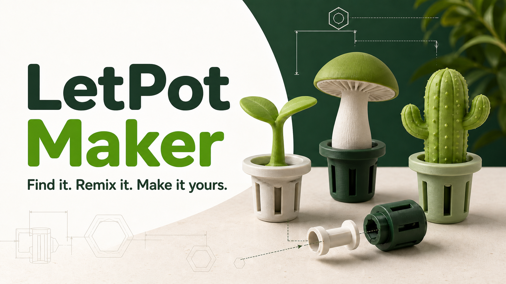

# LetPot Maker

LetPot Maker is an independent, open-source library and browser studio for designing, previewing, and exporting printable 3D accessories for LetPot indoor gardens.

The project started from a simple gap: small hydroponic accessories are easy to imagine but hard to share reliably when fit dimensions, print orientation, and source geometry are undocumented. LetPot Maker keeps those constraints in code so a design can be previewed, remixed, regenerated, and checked from the same source of truth.



> LetPot Maker is a community project, not an official LetPot product. LetPot is a trademark of its respective owner. The included models are prototypes and are not certified replacement or safety-critical parts.

## Current capabilities

- Browse and filter 34 checked-in printable designs.
- Preview the same parametric geometry used by the export pipeline.
- Customize topper height from 25–100 mm, width from 20–80 mm, model-specific details, colors, and surface style.
- Export watertight STL parts, OBJ assemblies, manifests, and Bambu Studio 3MF projects.
- Arrange low-poly accessories across four LetPot device layouts in Pod Styler.
- Turn a text idea into a constrained model recipe through an optional, provider-neutral AI endpoint.
- Generate a direct neural mesh with a user-supplied Tripo key, browser-to-Tripo calls, and device-local GLB caching.
- Validate model parameters, manifold geometry, printer-bed placement, and production routes.

The bounded AI feature selects or composes allowlisted geometry and never evaluates executable code. A separate opt-in Tripo mode accepts a user key, keeps it in memory by default with optional browser-local persistence, and downloads an untextured GLB directly into browser storage; the application server never receives that key, prompt, or mesh. The core library, Studio, previews, and exports work without either provider.

## Technology

| Area | Stack |
| --- | --- |
| Application | React 19, TypeScript, Vinext, Vite |
| 3D preview | Three.js |
| Solid geometry | Manifold |
| Export packaging | JSZip |
| Runtime | Node.js 22 |
| Deployment | Docker and Docker Compose |
| Quality gates | ESLint, TypeScript, Node test runner, geometry validators |

The application is intentionally client-heavy. Model construction and file packaging happen in the browser; the server handles rendered routes, health checks, and the optional bounded-AI recipe request. Direct Tripo meshes use IndexedDB rather than server storage. There is no application database, account system, or server-side model storage.

## Getting started

Requirements:

- Node.js 22.13 or newer
- npm 10 or newer

```bash
git clone <repository-url>
cd letpot-maker
npm ci
npm run dev
```

Open the URL printed by the development server. No environment variables are required for the standard maker workflow.

### Optional AI recipes

Create a local environment file:

```bash
cp .env.example .env.local
```

Set `AI_API_KEY`, `AI_BASE_URL`, and `AI_MODEL` for a provider that implements the standard OpenAI chat-completions messages format. Keep real credentials out of Git. See [AI generation](docs/ai-generation.md) for the supported shape boundary and security controls.

## Development workflow

| Command | Purpose |
| --- | --- |
| `npm run dev` | Start the development server |
| `npm run build` | Produce the standalone application build |
| `npm run check` | Run ESLint and TypeScript checks |
| `npm test` | Build, test rendered routes, and run all geometry validators |
| `npm run ci` | Run every check used by continuous integration |
| `npm run docker:deploy` | Build and health-check a local Compose deployment |
| `npm run docker:deploy-image` | Pull and deploy an immutable published image |
| `npm run generate:assets` | Regenerate the checked-in STL, OBJ, manifest, and stack-test assets |
| `npm run validate:assets` | Validate generated STL topology and adapter orientation |
| `npm run validate:parameters` | Exercise supported parameter boundaries |
| `npm run validate:ai` | Validate constrained AI recipes and printable output |
| `npm run validate:ai-security` | Test prompt screening and output allowlisting |
| `npm run validate:tripo` | Validate direct-mesh metadata and both standardized connection modes |
| `npm run validate:bambu` | Validate A1 mini and P1S 3MF packages |

Run `npm run ci` before opening a pull request. Generated model files must be rebuilt from `lib/model-factory.ts`; do not hand-edit STL, OBJ, 3MF, or generated `model-spec.json` files.

## Repository layout

```text
app/                  Routes, metadata, and API handlers
components/           Library, Maker Studio, and Pod Styler interfaces
lib/                  Model definitions, solidification, AI recipes, and 3MF output
public/models/         Generated printable assets and manifests
scripts/               Asset generation, validation, and deployment tools
tests/                 Production-route smoke tests
docs/                  Maintained architecture and operations documentation
.github/workflows/     Continuous integration
```

The geometry flow is:

```text
bounded parameters -> Three.js assembly -> Manifold solidification
                                      -> browser preview
                                      -> STL / OBJ / 3MF / manifest exports
```

See the [documentation index](docs/README.md) for architecture, AI integration, Docker deployment, and the shared [design system](docs/design-system.md). Read [CONTRIBUTING.md](CONTRIBUTING.md) before changing a shared mechanical interface or adding a model.

## Printable interface and safety

The initial collection uses a locked pod adapter: a Ø33 mm lower section, Ø41 mm upper band, 5.6 mm total height, and an R3.96 mm double-ended hex connector pin. The browser and validators treat these values as compatibility contracts.

Automated checks can verify topology and expected dimensions, but they cannot certify real-world fit, material suitability, food contact, heat resistance, electrical safety, or load-bearing performance. Calibrate the printer and test the adapter on the actual device before printing a full set.

## Docker deployment

The supplied Compose configuration binds to `127.0.0.1:3000` by default so the service can sit behind a private reverse proxy, VPN, or SSH tunnel.

```bash
cp .env.example .env
npm run docker:deploy
```

See [Docker deployment](docs/docker-deployment.md) before exposing the service to a network. The reverse proxy should provide TLS, authentication or access policy where needed, and request limits for AI-enabled deployments.

GitHub Actions treats `main` as the integration branch and `release` as the production promotion branch. Changes on `main` run lint, type checks, tests, geometry validation, and a production build without publishing or deploying. A pull request merged into protected `release` repeats those gates, publishes an immutable Linux AMD64 image to GHCR, deploys the exact image digest through a restricted SSH endpoint, verifies the public site, and creates generated GitHub Release notes. The container image is the only deployment artifact; releases do not duplicate it as an attached archive.

See [Docker deployment](docs/docker-deployment.md) for release protection, production Environment variables, server bootstrap, health checks, and rollback behavior.

## Contributing and license

Issues and pull requests are welcome. Please keep changes focused, include test-print evidence when it is available, and identify the license of any third-party media or geometry.

The project is distributed under the [MIT License](LICENSE). Contributions must be original or have redistribution terms compatible with the repository. Security concerns should follow [SECURITY.md](SECURITY.md).
